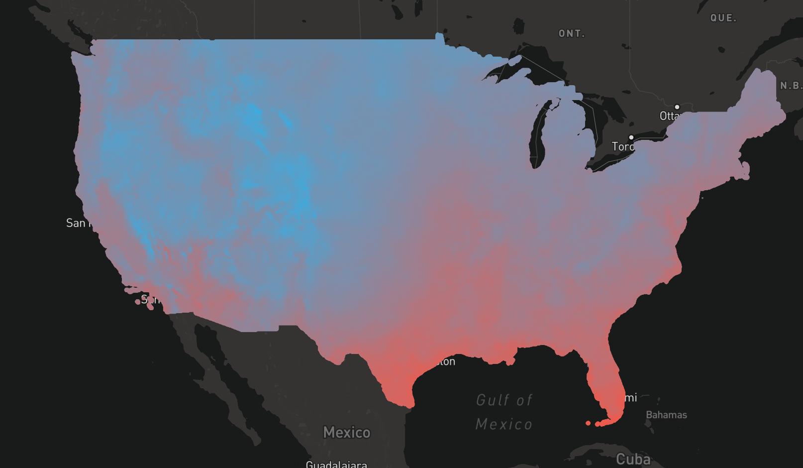

# Temperature Mapping



# Setup

You'll need a recent version of a good browser (tested in Chrome, FF, and Safari). You will need an
install of Node 6.x because I use some ES6 features. To set up and run the project, execute the
following commands in the project directory:

```sh
npm install
npm run start
```

If the app starts correctly, you should be able to view it [here](http://localhost:8181).

The app behaves similarly to Google Maps or other web map tools. Drag to pan, mousewheel to zoom in
and out. If you hold shift and drag a rectangle, you will get an average temperature readout of the 
contained geography at the top of the screen.

# The app

Running the above will start a nodejs app that serves a bit of HTML and two API endpoints: 

The first is a tile server that serves [slippy map](https://wiki.openstreetmap.org/wiki/Slippy_Map)
tiles in a MVT (Mapbox Vector Tile) format. MVT uses protobuf as a transport protocol, so very large
numbers of points can be efficiently served; it can serve the half-million or so points in a few
seconds across the wire at a cost of about 4.5 meg. To serve that in any other format, like geojson
or topojson would involve hundreds of megs of data, huge amounts of RAM, or very high levels of 
simplification. (I tried several alternatives before resting on the current solution!) The tiles and
basemap are rendered using MapboxGL.

The second endpoint fetches the average temperature for a given set of lat/lng bounds. This calls
the `averageTemperature` function and returns it to the UI. It can reduce over the entire nation
of data points in less than a second, which seems like satisfactory performance.

